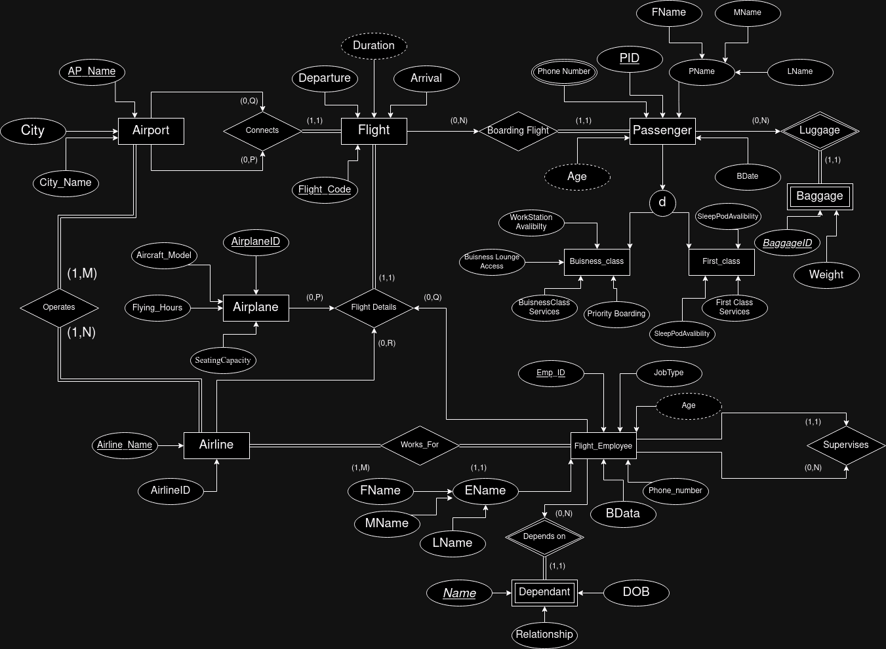
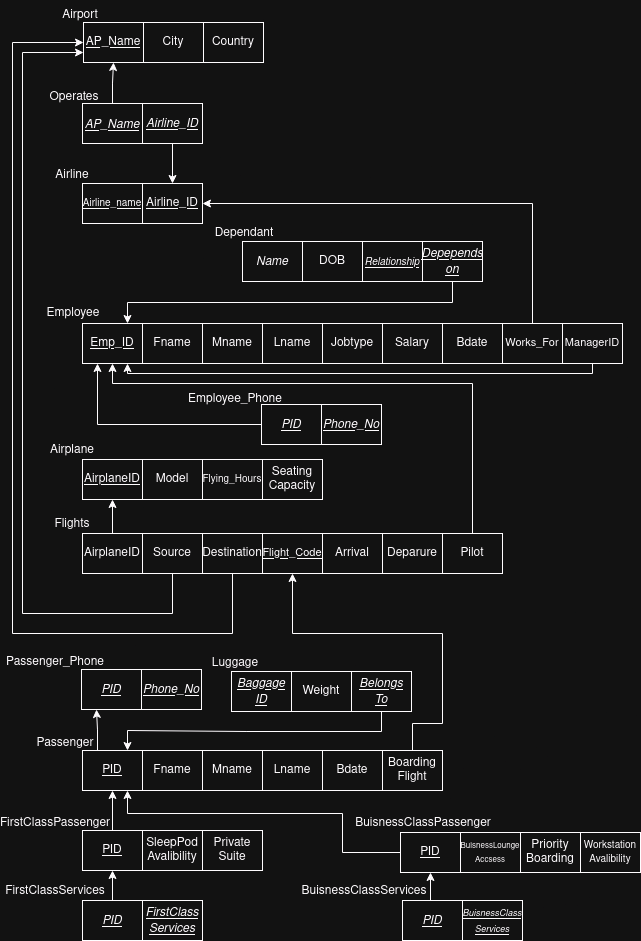

# Airline Management System

A relational database for airline operations (airports, airlines, flights, aircraft, employees, passengers, and baggage) with a menu-driven Python CLI for running common operations and reports against it.

## Database design

The schema has 15 tables in MySQL, linked by 17 foreign keys and normalized step by step (see `Phase_3.pdf`).

| ER diagram | Relational model |
| --- | --- |
|  |  |

- **Core entities:** `Airport`, `Airline`, `Airplane`, `Flight`, `Passenger`, `Baggage`
- **Staff:** `Flight_Employee`, `Employee_Phone`, `Dependents`
- **Passenger classes:** `First_Class_Passenger` and `Business_Class_Passenger`, each with its own services table
- **Relationships:** `Operates` links airlines to the airports and flights they run

`airline.sql` creates the `AIRLINE` database, all tables, and sample data.

## CLI

`main.py` logs in to MySQL and offers these operations:

| Kind | Operations |
| --- | --- |
| Updates | Hire, fire, or promote an employee; add or delete an airport; delete an airline or a baggage record |
| Reports | Employees at an airport; airlines operating at an airport; average employee salary per airport; flights per airline at an airport; total baggage weight per passenger on a flight |
| Search | Find passengers by name |

Each module (`employee.py`, `airport.py`, `passenger.py`, `airline.py`, `baggage.py`, …) wraps the SQL for one entity.

A screen recording of the CLI in use is included (`Screencast from 28-11-24 07:19:34 PM IST.webm`).

## Running it

```bash
pip install pymysql
mysql -u <user> -p < airline.sql   # create the AIRLINE database with sample data
python main.py                      # log in with your MySQL user
```

The CLI connects to MySQL on `localhost:3306`.

## Reports

- `Phase_1.pdf`: requirements and the ER model
- `Phase_3.pdf` / `24.pdf`: relational model and normalization
- `README.pdf`: original project notes
